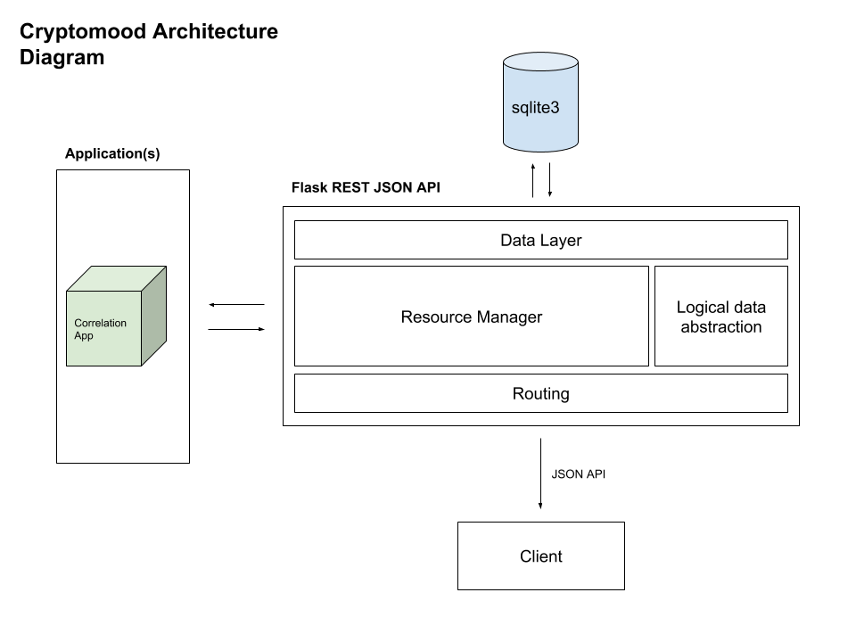

# Invitae Cryptomood Takehome Assignment 

Overview
---
This repository contains files for a short data engineer assignment for Invitae.

There are 3 folders in this project:
- assets
- cryptomood-repo
- raw

The assets folder houses architecture diagrams and any other miscellaneous assets.

The crypto-mood folder holds converted CSV files of the original data, an iPython notebook containing the code for the project, and a database backup.

The raw folder holds the original assignment and data.

This README file serves as a project write-up, details my thought process, and also includes potential improvements for a Production setting. 

The Assignment
---

This project prototypes a system for monitoring crypto currency prices and sentiment of Twitter messages surrounding the coins of interest. It is meant to be a homework exercise for Data Engineers interviewing at Invitae. We hope that our candidates will ask questions and treat this exercise as a chance to collaborate with Invitae's team prior to joining.

The goals of this project:
* Implement one core feature: Historical correlation view of sentiment to price.

In more detail this means:
* Perform a correlation analysis on the historical sentiment and price data.
* Use the provided data files to perform a correlation between cryptocurrency price and twitter sentiment.  It should utilize the data in ``historical_coin_data.txt`` and ``historical_sentiment_data.txt`` to build the correlation.

Bonus:
* High-level discussion of architecture for productionizing this project. Consider the following: moving to a real-time streaming architecture instead of batch based

### Dependencies  
* Python
* sqlite3
* Jupyter Notebook
* matplotlib
* numpy
* pandas
* plotly
* psycopg2
* sqlalchemy
* csv
* Flask
* json

## Notebook Details  

### `Cryptomood.ipynb`  

`Cryptomood.ipynb` generates four basic REST endpoints for consumption by other teams/engineers. The most important being the correlation between the price and sentiment_polarity time series data.

**Overall Architecture**  
A simple overview of the architecture can be seen below and is housed in the assets folder of this project.

**Generating Correlation Between Price and Sentiment**  
Pandas did the heavy lifting for this portion of the project. A few steps are outlined below:

The first few sections of code are just gathering an overview of the two data sets. Two time series based graphs give you a great high level look at crypto prices and sentiment polarity.

I parsed down the data sets to just take a look at price and sentiment polarity since these were the two items of interest.

The next step involved finding the best way to compare price versus sentiment polarity. It is pretty clear that date and time would be the easiest mechanism based on the provided datasets. Fortunately, Pandas includes a simple function to merge the data.

The `merge_asof` function is able to take two dataframes and compare the nearest datetime. This makes it easy to see how sentiment is being affected by buy/sell price fluctuations. This generates a great view with the timestamp, price, and sentiment polarity with ~300 rows of data. Sample below:

|          timestamp            |    price    | sentiment_polarity |
|-------------------------------|-------------|--------------------|
|  2018-07-16 20:11:51.747745	|  427.92188  |      0.244146      |
|  2018-07-16 20:11:52.628113	|  6101.3773  |      0.244146      |
|  2018-07-16 20:11:53.164516	|  5842.1663  |      0.244146      |
|  2018-07-16 20:11:53.722737	|  437.65019  |      0.244146      |
|  2018-07-16 20:11:54.050962	|  5453.5961  |      0.288919      |
|  2018-07-16 20:11:54.572711	|  476.54839  |      0.288919      |
|  2018-07-16 20:11:55.110619	|  77.700954  |      0.288919      |
|  2018-07-16 20:11:55.728178	|  492.01925  |      0.315483      |
|  2018-07-16 20:11:56.522702	|  5374.6697  |      0.315483      |
|  2018-07-16 20:11:57.278040	|  513.92057  |     -0.282642      |

The next step involved finding the correlation coefficient for this dataset. Again, Pandas makes it incredibly simple to do this calculation. You can see that the correlation coefficient is ~0.11, which indicates very little correlation between price and sentiment.

|        first timestamp         |        last timestamp          |    correlation coefficient   |
|--------------------------------|--------------------------------|------------------------------|
|   2018-07-16 20:11:51.747745   |   2018-07-16 20:14:58.357503   |      0.10693711137928621     |

**Building a RESTful Endpoint**  
Now that the most important piece of information has been generated, it's time to allow others to access this data.

There are quite a few improvements that would need to be made in a production environment, but I felt that this best exemplified how to make data accessible to other teams and could be developed within a reasonable timeframe.

Using Flask and sqlite3, it was fairly straight forward to stand up a few different endpoints. I first loaded all of the raw coin and sentiment polarity data into two separate tables. Next, I threw the new data into their own tables as well. This includes both the merged dataset of price and sentiment polarity and finally just the correlation coefficient.

The correlation coefficient data also includes the start and end datetime, which provides useful information for anyone analyzing the data. 

I then established four separate classes to make basic database calls and generate JSON objects. Flask then adds routes to make these JSON objects accessible. If you aren't able to get the project running for any reason, the assets folder includes sample JSON files.

Overall, I think this offers a modern solution for anyone to consume, parse, or do anything they please with the raw data and data insights.

The endpoints can be reached at the following links once the notebook has been run:
* [/correlation](http://127.0.0.1:5002/correlation)
* [/coin](http://127.0.0.1:5002/coin)
* [/sentiment](http://127.0.0.1:5002/sentiment)
* [/merged](http://127.0.0.1:5002/merged)

**Key Takeaways**  
Below are some key takeaways from this assignment:

- With a correlation coefficient of ~0.11 between historical price and sentiment polarity, this indicates that price does not seem to affect sentiment on Twitter
- As more data is generated, we will be able to see better trends over time. It will also give consumers more flexibility for their requirements of generating the correlation insight
- The tool does not feel complete. As this is a small assignment, there is a lot of room for improvement. See the **Potential Improvements** and **Productionizing this project** sections for more details
- The charts generated at the beginning of the notebook are a small taste of what could be a larger dashboard. This would allow data scientists to easily visualize the datasets
- REST APIs were chosen due to flexiblity and ease of use. Other engineers, data scientists, etc. would be able to easily consume the JSON objects using CURL or similar packages in Python

## Running the Notebooks  

### `Cryptomood.ipynb`  
Details for running the notebook below:

Download repo

At the command prompt

    cd cryptomood-repo
    jupyter notebook

Open `Cryptomood.ipynb` in your browser. Select Kernel > Restart & Run All

### Troubleshooting

If you run into any problems with the database, go to the cryptomood-repo folder and remove `cryptomood.db` if it exists.

You should be able to hookup the `cryptomood_backup` instead. This holds all of the necessary data to view the REST endpoints. 

Either rename the backup to `cryptomood.db` or edit db_connect in the last cell.

Then start serving the Flask app by running the last cell in the Notebook.

## Potential Improvements  
`Cryptomood.ipynb` provides a rudimentary example of generating data for a set of stakeholders. I say this for a few reasons:
* The APIs don't allow for custom date formats to be returned. Over time, users would want to choose a date range for which a correlation coefficient would be returned. Or possibly even set it from the start when determining requirements. I could see it being generated at thirty minute, hourly, daily, or monthly intervals
* sqlite3 is only used for demonstration purposes since it is lightweight and easy to setup
* A front end view or dashboard of the data is not provided. This could be useful, but is probably more appropriate for data scientists or web developers to create using the JSON endpoints

## Productionizing this project  
Taking this project into a production setting would require quite a few improvements. Most notably around stream processing versus batch based updates using Kafka. Check out the simple diagram below or at this [link](https://towardsdatascience.com/getting-started-with-apache-kafka-in-python-604b3250aa05)

NOTE: This image is also available in the assets folder

In both a batch based and stream based production setting, I would imagine the data would be pushed into a database or just straight to the Kafka system. This would replace the text file based mechanism for importing the data that I used in this project. It should be straight forward to tap into the Coinbase and Twitter APIs to gather this data in real-time.

Below are high level details for stream based processing:

As the raw data is being generated, a producer would push the crypto data (both coin and sentiment) into the Kafka system. Data would then be transformed (e.g. correlation calculated) and published to a topic of your choice.

This published topic would also house json rendered data for easy consumption downstream.

Topics would then be utilized by a consumer application or team. They would subscribe to a topic of their choice and consume the json data. In this case, it would most likely just be 1-4 topics. Three of them being raw data and the last being the correlation data.

The topic would most likely need to generate correlation on a fixed time stamp or intervals (e.g. hourly, daily, monthly, etc.). Each of these could populate their own topic if needed.

There are a few advantages of a distributed streaming platform with real-time data feeds.
- Reduces the need for multiple integrations. You now only need one integration fo each producing system and each consuming system
- Decreased latency and increased horizontal scalability. Big data is manageable with Kafka and large models can receive data in real-time if need be
- Accessibility. With a centralized data system (Kafka), teams can access their data needs more easily. They will no longer need to reach out to a variety of teams (e.g. web team, data engineering team, etc.) for personalized data sets or endpoints. It all lives in Kafka
- Kafka, as it is a clustered system, provides more stability versus solely relying on source and target systems

As I am new to Kafka, apologies if any of this needs correction. I'm very open to any feedback on taking this into a Production setting using Kafka.

Below are a few links that helped me get up to speed with Kafka:
1. https://www.rittmanmead.com/blog/2017/01/getting-started-with-spark-streaming-with-python-and-kafka/
2. https://www.oreilly.com/ideas/data-architectures-for-streaming-applications
3. https://www.oreilly.com/ideas/the-world-beyond-batch-streaming-101
4. https://towardsdatascience.com/getting-started-with-apache-kafka-in-python-604b3250aa05

## Outstanding Questions  
Below are a few questions that came up during this project:
- Coinbase and Twitter seem to be the source systems for this data (?). If I had the time, it would have been fun to tap into these APIs and stand up Kafka to consume the data in real-time. API docs can be found [here](https://developers.coinbase.com/docs/wallet/guides/price-data) and [here](https://developer.twitter.com/en/use-cases/analyze.html)
- Were there requirements for calculating correlation? I calculated it over the course of a few minutes based on the data I received
- Are data engineers expected to create views (i.e. graphs, data visualizations) at Invitae? Happy to demonstrate this if it is helpful, but assumed other teams would be handling this
- Please let me know if any of my assumptions were incorrect. Very open to candid feedback